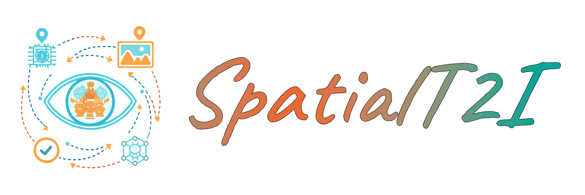
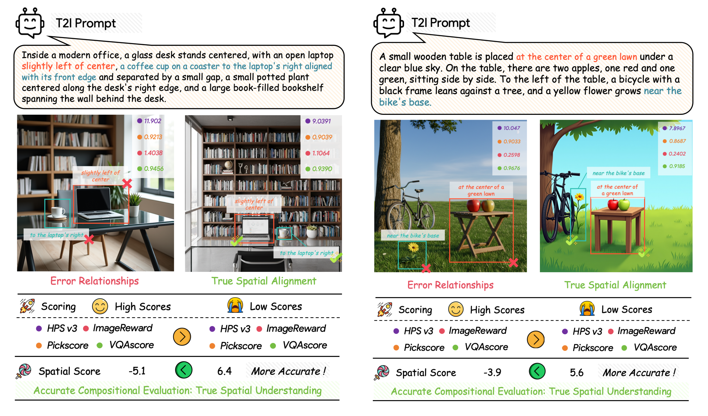
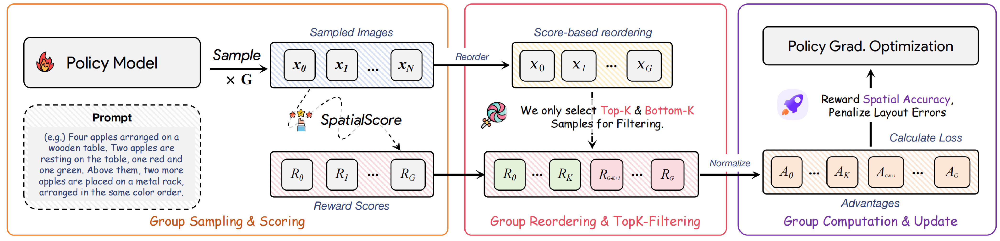

<div align="center">
<h2 align="center">
  
  <br>
  <a href="https://github.com/DAGroup-PKU/SpatialReward">Enhancing Spatial Understanding in Image Generation via Reward Modeling</a>
</h2>

**Zhenyu Tang**<sup>1,2*</sup>, **Chaoran Feng**<sup>1*</sup>, **Yufan Deng**<sup>1,2</sup>, **Jie Wu**<sup>2</sup>, **Xiaojie Li**<sup>2</sup>, <br>
**Rui Wang**<sup>2</sup>, **Yunpeng Chen**<sup>2</sup>, **Daquan Zhou**<sup>1</sup>

<sup>1</sup>Peking University &nbsp;&nbsp; <sup>2</sup>ByteDance Seed
<br>
<small>*Equal Contribution</small>

[](https://dagroup-pku.github.io/SpatialReward/)
[](https://arxiv.org/)
[]()
[]()
[](https://creativecommons.org/licenses/by-nc/4.0/)


</div>

---
## 📅 News

*   `[2026.0X]` 📄 Paper is now available on arXiv.
*   `[2026.0X]` 🚀 Project page is live.
*   `[TBD]` 🚧 We are planning to release the **SpatialReward-Dataset** and **SpatialScore** model weights. Please stay tuned!

## 📖 Abstract

Text-to-image models have made significant strides in visual fidelity but often struggle with **complex spatial relationships**. Existing reward models often fail to capture these intricate spatial constraints. 

In this work, we introduce a novel method to strengthen spatial understanding in image generation:
1.  **SpatialReward-Dataset**: A curated dataset with over **80k preference pairs**, featuring adversarial spatial perturbations verified by humans.
2.  **SpatialScore**: A VLM-based reward model (built on Qwen2.5-VL) that surpasses proprietary models (e.g., GPT-5, Gemini 2.5) in spatial evaluation accuracy.
3.  **Spatial-RL**: We demonstrate that `SpatialScore` effectively enables online Reinforcement Learning (specifically GRPO with Top-k filtering), yielding significant gains in spatial generation capabilities.

<div align="center">
  
  <br>
  <em>Figure 1: Existing reward models often assign high scores to spatially incorrect images. SpatialScore provides accurate feedback, enabling better alignment.</em>
</div>

## 🔥 Highlights & Contributions

### 1. SpatialReward-Dataset
We constructed a large-scale dataset focusing on spatial logic. Each entry consists of a "Perfect Image" (aligned with the text) and a "Perturbed Image" (with subtle spatial violations), creating a hard negative sample for robust training.

### 2. SpatialScore: State-of-the-Art Reward Model
By fine-tuning **Qwen2.5-VL**, our SpatialScore achieves superior performance in evaluating spatial relationships, outperforming strong baselines including HPS v2/v3, ImageReward, and even proprietary VLM APIs on our benchmarks.

| Model | Overall Accuracy |
| :--- | :---: |
| HPS v2.1 | 46.3% |
| ImageReward | 47.9% |
| GPT-5 (API) | 89.0% |
| Gemini-2.5 Pro | 95.1% |
| **SpatialScore (Ours)** | **95.8%** |

### 3. Reinforcement Learning with Top-k Filtering
We apply **GRPO (Group Relative Policy Optimization)** using SpatialScore as the feedback signal. To handle reward noise and prompt difficulty variance, we introduce a **Top-k filtering strategy**, which significantly stabilizes training and improves convergence.

<div align="center">
  
</div>

## 🖼️ Visual Results

Our method significantly improves the spatial layout capability of Flux.1-dev.

  
  <br>
  <em>Comparison of generated images using complex spatial prompts.</em>
</div>


## ✏️ Citation

If you find our work useful, please cite our paper:

```bibtex
@article{tang2025enhancing,
  title={Enhancing Spatial Understanding in Image Generation via Reward Modeling},
  author={Tang, Zhenyu and Feng, Chaoran and Deng, Yufan and Wu, Jie and Li, Xiaojie and Wang, Rui and Chen, Yunpeng and Zhou, Daquan},
  journal={arXiv preprint arXiv:xxxx.xxxxx},
  year={2025}
}
```

## ⚖️ License
This project is licensed under the Creative Commons Attribution-NonCommercial 4.0 International License (CC BY-NC 4.0). For more details, please refer to the [LICENSE](LICENSE) file.
